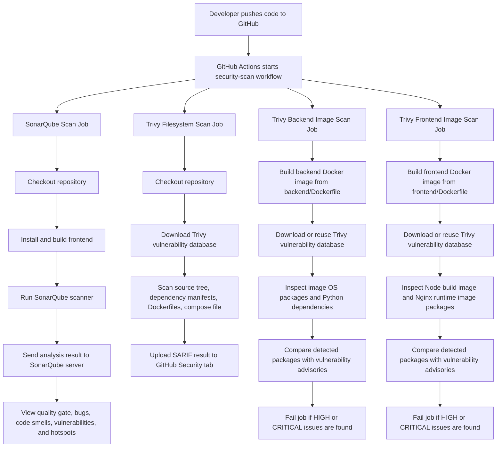
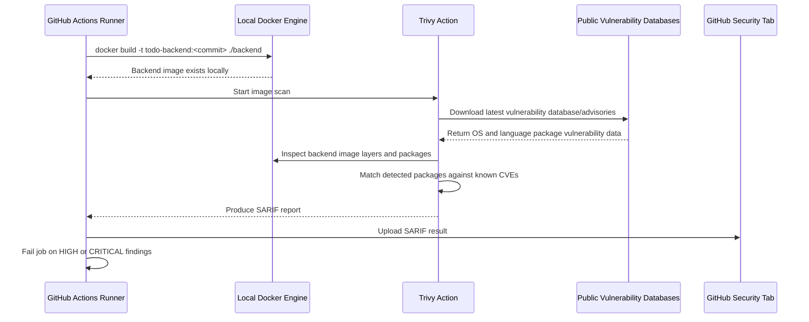

# SonarQube and Trivy Scan Configuration

This document explains how this Todo application is scanned using SonarQube and Trivy in GitHub Actions.

Application stack:

| Layer | Technology | Main files scanned |
| --- | --- | --- |
| Backend | Python, FastAPI | `backend/app`, `backend/requirements.txt`, `backend/Dockerfile` |
| Frontend | React, JavaScript, Vite | `frontend/src`, `frontend/package.json`, `frontend/Dockerfile` |
| Database | PostgreSQL | `database/init.sql` |
| DevOps | Docker Compose | `docker-compose.yml` |

## Tools Used

| Tool | Main purpose | Account required? | Current workflow usage |
| --- | --- | --- | --- |
| SonarQube | Static code analysis for maintainability, bugs, code smells, vulnerabilities, and security hotspots | Yes | Scans `backend/app` and `frontend/src` |
| Trivy | Open-source vulnerability, dependency, container image, secret, and IaC/misconfiguration scanning | No for normal scans | Scans repo filesystem and built Docker images |

## High-Level Flow



## SonarQube Configuration

The repository uses this file:

```text
sonar-project.properties
```

Current configuration:

```properties
sonar.projectKey=todo-app
sonar.projectName=Todo App
sonar.organization=replace-with-your-sonarcloud-organization-key
sonar.projectVersion=1.0

sonar.sources=backend/app,frontend/src
sonar.tests=backend/tests
sonar.exclusions=**/node_modules/**,**/__pycache__/**,**/dist/**
sonar.python.coverage.reportPaths=coverage.xml

sonar.python.version=3.12
sonar.sourceEncoding=UTF-8
```

### Required Credentials

SonarQube needs an account and token because the scan results are uploaded to a SonarQube server or SonarQube Cloud project.

Add these GitHub repository secrets:

| Secret | Example | Purpose |
| --- | --- | --- |
| `SONAR_TOKEN` | `sqp_xxxxx` | Authenticates the scanner |

This repository is configured for SonarQube Cloud:

```text
SONAR_HOST_URL=https://sonarcloud.io
```

The workflow sets `SONAR_HOST_URL` directly, so only `SONAR_TOKEN` is required as a GitHub secret.

For SonarQube Cloud, replace the organization key in `sonar-project.properties`:

```properties
sonar.organization=your-organization-key
```

### How to Collect SonarCloud Values

Use these steps when using https://sonarcloud.io/.

#### 1. Get `SONAR_TOKEN`

1. Log in to https://sonarcloud.io/.
2. Click your profile icon in the top-right corner.
3. Open **My Account**.
4. Go to **Security**.
5. Under **Generate Tokens**, enter a token name such as:

```text
github-actions-todo-app
```

6. Click **Generate Token**.
7. Copy the token immediately. SonarCloud only shows it once.
8. In GitHub, open your repository.
9. Go to **Settings** > **Secrets and variables** > **Actions**.
10. Create a new repository secret:

```text
Name:  SONAR_TOKEN
Value: <paste-the-token-from-sonarcloud>
```

Do not commit the token into the repository.

#### 2. Get `sonar.organization`

1. Log in to https://sonarcloud.io/.
2. Open your organization from the SonarCloud dashboard.
3. Go to **Organization Settings**.
4. Find the **Organization Key**.
5. Copy that value into `sonar-project.properties`:

```properties
sonar.organization=your-organization-key
```

Example:

```properties
sonar.organization=my-devops-org
```

#### 3. Get `sonar.projectKey`

If the project already exists in SonarCloud:

1. Open https://sonarcloud.io/.
2. Open your project.
3. Go to **Project Information** or **Project Settings**.
4. Copy the **Project Key**.
5. Put it in `sonar-project.properties`:

```properties
sonar.projectKey=your-project-key
```

If you are importing the project from GitHub for the first time:

1. In SonarCloud, click **Analyze new project**.
2. Select your GitHub organization/repository.
3. Follow the setup wizard.
4. SonarCloud will show the generated project key.
5. Copy that value into `sonar-project.properties`.

Example:

```properties
sonar.projectKey=my-devops-org_todo-app
```

#### 4. Set `sonar.projectName`

`sonar.projectName` is the display name shown in SonarCloud. You can choose a readable name.

Example:

```properties
sonar.projectName=Todo App
```

This does not need to match the GitHub repository name exactly, but it should be clear for humans.

#### 5. Final SonarCloud Example

After collecting the values, `sonar-project.properties` should look similar to this:

```properties
sonar.projectKey=my-devops-org_todo-app
sonar.projectName=Todo App
sonar.organization=my-devops-org
sonar.projectVersion=1.0

sonar.sources=backend/app,frontend/src
sonar.tests=backend/tests
sonar.exclusions=**/node_modules/**,**/__pycache__/**,**/dist/**
sonar.python.coverage.reportPaths=coverage.xml

sonar.python.version=3.12
sonar.sourceEncoding=UTF-8
```

The GitHub Actions workflow already sets:

```yaml
SONAR_HOST_URL: https://sonarcloud.io
```

So for SonarCloud, the only GitHub secret required by this repository is:

```text
SONAR_TOKEN
```

### Failing the Workflow on SonarCloud Issues

The GitHub Actions workflow waits for the SonarCloud Quality Gate result:

```yaml
- name: Run SonarQube scan
  uses: SonarSource/sonarqube-scan-action@v8
  with:
    args: >
      -Dsonar.qualitygate.wait=true
```

This means the SonarCloud scan job fails if the project Quality Gate fails.

SonarCloud does not fail the workflow just because any issue exists. It fails based on the Quality Gate conditions configured in SonarCloud.

Examples of Quality Gate conditions you can configure:

| Gate condition | Example policy |
| --- | --- |
| Security rating | Fail if Security rating is worse than `A` |
| Reliability rating | Fail if Reliability rating is worse than `A` |
| Maintainability rating | Fail if Maintainability rating is worse than `A` |
| Vulnerabilities | Fail if vulnerabilities are greater than `0` |
| Bugs | Fail if bugs are greater than `0` |
| Code smells | Fail if code smells are greater than an accepted limit |
| Security hotspots reviewed | Fail if reviewed hotspots are less than `100%` |
| Coverage | Fail if coverage is below the required percentage |
| Duplications | Fail if duplicated lines are above the allowed percentage |

To configure this in SonarCloud:

1. Open the SonarCloud project.
2. Go to **Quality Gates**.
3. Create or edit a Quality Gate.
4. Add conditions for the priorities you care about.
5. Assign that Quality Gate to the project.

For this demo repository, a strict gate could be:

| Metric | Condition |
| --- | --- |
| Vulnerabilities | Greater than `0` fails |
| Bugs | Greater than `0` fails |
| Security rating | Worse than `A` fails |
| Reliability rating | Worse than `A` fails |
| Security hotspots reviewed | Less than `100%` fails |
| Coverage | Less than `50%` fails |
| Duplicated lines | Greater than `3%` fails |

### What SonarQube Covers

SonarQube is mainly used for source code quality and secure coding checks.

Important issue types:

| Issue type | Meaning |
| --- | --- |
| Bugs | Code likely to behave incorrectly |
| Vulnerabilities | Security-sensitive coding defects |
| Security hotspots | Security-sensitive code that should be reviewed |
| Code smells | Maintainability problems |
| Duplications | Repeated code blocks |
| Coverage | Test coverage, if reports are provided |

### SonarCloud Result Examples

| SonarCloud result | What it means | Basic example |
| --- | --- | --- |
| Security | A real security vulnerability that should be fixed | Building SQL using string concatenation: `"SELECT * FROM todos WHERE title = '" + title + "'"` |
| Reliability | A likely bug or runtime failure | Calling `todo.title.upper()` when `todo.title` could be `None` |
| Maintainability | Code smell that makes the code harder to read, change, or test | A very long function with many nested `if` conditions |
| Security Hotspot | Security-sensitive code that needs human review | Using wildcard CORS such as `allow_origins=["*"]` |
| Hotspots Reviewed | Percentage of security hotspots reviewed by a developer | `100%` means all hotspots are reviewed or none are pending |
| Coverage | Percentage of code executed by automated tests | Tests call `health()` and `row_to_dict()`, so those lines are covered |
| Duplications | Repeated code blocks detected in source files | Two functions containing the same 10-line formatting logic |

For this repository, `backend/app/security_demo.py` intentionally contains examples that can trigger Security, Maintainability, and Duplication findings in SonarCloud.

### Languages Supported

SonarQube supports many languages depending on edition and version. For this application, the important supported languages are:

| Language / file type | Used in this app? |
| --- | --- |
| Python | Yes, backend FastAPI code |
| JavaScript / JSX | Yes, React frontend |
| CSS | Yes, frontend styling |
| Dockerfile | Useful for Docker-related analysis where supported |
| YAML | Useful for workflow/config analysis where supported |

## Trivy Configuration

Trivy is configured in:

```text
.github/workflows/security-scan.yml
```

The workflow runs three Trivy scans:

| Job | Target | What it checks |
| --- | --- | --- |
| `trivy-filesystem` | Repository files | Dependencies, IaC/misconfigurations, secrets where enabled by Trivy defaults/action settings |
| `trivy-backend-image` | Built backend Docker image | Python base image packages, OS packages, Python dependencies |
| `trivy-frontend-image` | Built frontend Docker image | Node build image packages, Nginx runtime image packages, npm dependencies when detectable |

Each Trivy job uses two scan steps:

| Step type | Output format | Purpose |
| --- | --- | --- |
| SARIF report | `sarif` | Uploads findings to GitHub Security without failing before upload |
| Readable gate | `table` | Prints a clear developer-friendly report and fails the job on configured severity |

The SARIF report uses `exit-code: 0`, so GitHub Security results are still generated and uploaded. The readable gate uses `exit-code: 1`, so the pipeline fails with a table-style report that developers can read directly in the GitHub Actions log.

### What Trivy Filesystem Scan Covers

The filesystem scan uses:

```yaml
scan-type: fs
scan-ref: .
```

This means Trivy scans the repository folder directly, before the application is packaged into Docker images.

For this application, the filesystem scan can inspect files such as:

| File or folder | Why it matters |
| --- | --- |
| `backend/requirements.txt` | Checks Python runtime dependencies for known vulnerabilities |
| `backend/requirements-dev.txt` | Checks Python test/dev dependencies for known vulnerabilities |
| `frontend/package.json` | Checks Node.js dependencies declared by the frontend |
| `frontend/package-lock.json` | Checks exact installed npm dependency versions if the lockfile exists |
| `backend/Dockerfile` | Checks Dockerfile security and configuration patterns |
| `frontend/Dockerfile` | Checks frontend Dockerfile security and configuration patterns |
| `docker-compose.yml` | Checks container configuration and compose-level misconfigurations |
| `database/init.sql` | Can inspect SQL files as repository content, though vulnerability detection is limited |
| `.github/workflows/security-scan.yml` | Can inspect workflow/config files as repository content |

Common findings from a filesystem scan:

| Finding area | Example |
| --- | --- |
| Dependency vulnerabilities | A vulnerable Python package version in `requirements.txt` |
| npm vulnerabilities | A vulnerable React/Vite dependency in npm files |
| Dockerfile misconfigurations | Risky image configuration or running containers as root |
| Docker Compose misconfigurations | Insecure container settings |
| IaC issues | Kubernetes, Terraform, Helm, or CloudFormation issues if those files exist |
| Secrets | Committed API keys, private keys, GitHub tokens, or AWS keys |
| License metadata | Package license information where available |

Filesystem scan and image scan are different:

| Scan type | What it checks |
| --- | --- |
| Filesystem scan | Source files, dependency manifests, Dockerfiles, compose files, and config files |
| Image scan | The final built Docker image, including OS packages and installed dependencies |

### Why Trivy Does Not Need an Account

Trivy runs directly on the GitHub Actions runner. It does not need a Trivy account for normal public vulnerability scanning.

Backend image scan flow:



### What Trivy Downloads

During a normal scan, Trivy downloads vulnerability databases and advisory data from public sources. It then compares the packages found in this repository or Docker image against known vulnerabilities.

For this backend image:

| Source in image | Example |
| --- | --- |
| Base image OS packages | Debian packages from `python:3.12-slim` |
| Python packages | Packages from `backend/requirements.txt` |
| Application files | Files copied from `backend/app` |

For this frontend image:

| Source in image | Example |
| --- | --- |
| Node build image packages | Packages from `node:22-alpine` build stage |
| Runtime image packages | Packages from `nginx:1.27-alpine` |
| npm packages | React, Vite, and related dependencies |

### What Trivy Covers

Important scan areas:

| Area | Examples |
| --- | --- |
| OS package vulnerabilities | Alpine, Debian, Ubuntu, Red Hat, and other distro packages |
| Language dependency vulnerabilities | Python pip packages, Node.js npm packages, Java Maven packages, Go modules, Ruby gems, Rust crates, .NET NuGet packages, and others |
| Container image vulnerabilities | Vulnerable packages inside Docker images |
| IaC misconfigurations | Dockerfile, Kubernetes, Terraform, Helm, CloudFormation, ARM templates |
| Secrets | Accidentally committed tokens, passwords, and keys |
| SBOM/license support | Can generate and scan SBOM-style inputs depending on configuration |

### Languages and Ecosystems Supported by Trivy

Trivy supports vulnerability scanning for many package ecosystems. Common ones include:

| Ecosystem | Example files |
| --- | --- |
| Python | `requirements.txt`, lock files, installed pip packages |
| Node.js | `package.json`, `package-lock.json`, npm/yarn/pnpm lock files |
| Java | Maven and Gradle dependency files |
| Go | `go.mod`, `go.sum` |
| .NET | NuGet package files |
| PHP | Composer files |
| Ruby | Gemfile and lock files |
| Rust | Cargo files |
| OS packages | `apk`, `dpkg`, `rpm` packages inside images |

## GitHub Actions Workflow Summary

The workflow file is:

```text
.github/workflows/security-scan.yml
```

It runs on:

```yaml
push:
  branches:
    - main
    - master
pull_request:
  branches:
    - main
    - master
workflow_dispatch:
```

The Trivy jobs currently use:

```yaml
severity: HIGH,CRITICAL
ignore-unfixed: true
exit-code: 1
```

Meaning:

| Setting | Meaning |
| --- | --- |
| `severity: HIGH,CRITICAL` | Only fail/report for high-risk findings in this workflow |
| `ignore-unfixed: true` | Ignore issues where no vendor fix is available yet |
| `exit-code: 1` | Fail the GitHub Actions job when matching findings exist |

## When Credentials Are Needed

| Scenario | Credentials needed? | What credential |
| --- | --- | --- |
| SonarQube scan | Yes | `SONAR_TOKEN`, `SONAR_HOST_URL` |
| SonarQube Cloud scan | Yes | `SONAR_TOKEN`, `SONAR_HOST_URL`, usually `sonar.organization` |
| Trivy scan of local repo | No | None |
| Trivy scan of locally built Docker image | No | None |
| Trivy scan of private registry image | Yes | Registry username/password or token |
| Upload SARIF to GitHub Security tab | Usually no custom secret | Uses GitHub Actions token and `security-events: write` permission |

## Local Commands

Run Trivy locally:

```bash
trivy fs .
trivy image todo-backend:local
trivy image todo-frontend:local
```

Build local images first:

```bash
docker build -t todo-backend:local ./backend
docker build -t todo-frontend:local ./frontend
```

Run SonarQube scanner locally after setting credentials:

```bash
sonar-scanner \
  -Dsonar.host.url=http://localhost:9000 \
  -Dsonar.token=<your-token>
```

## Recommended Review Process

1. Pull request opens.
2. GitHub Actions runs SonarQube and Trivy scans.
3. Review SonarQube quality gate for code quality and security hotspots.
4. Review GitHub Security tab for Trivy SARIF findings.
5. Fix `CRITICAL` and `HIGH` findings before merging.
6. Track lower-severity issues separately if they are not blocking.

## Demo Issues in This Repository

The file below intentionally contains scanner training examples:

```text
backend/app/security_demo.py
```

It is not used by the running Todo API. It exists only to demonstrate how SonarCloud reports issues such as:

| Demo issue | Example pattern |
| --- | --- |
| Security | SQL query built with string concatenation |
| Security hotspot | Weak hashing with MD5 |
| Maintainability | Complex nested conditional logic |
| Duplication | Repeated summary formatting logic |

Remove this file before treating the project as production-ready.

## References

- SonarQube documentation: https://docs.sonarsource.com/
- SonarQube language overview: https://docs.sonarsource.com/sonarqube-server/analyzing-source-code/languages/overview
- Trivy documentation: https://trivy.dev/
- Trivy vulnerability scanning: https://trivy.dev/docs/latest/scanner/vulnerability/
- Trivy misconfiguration scanning: https://trivy.dev/docs/latest/scanner/misconfiguration/
- Trivy secret scanning: https://trivy.dev/docs/latest/scanner/secret/
